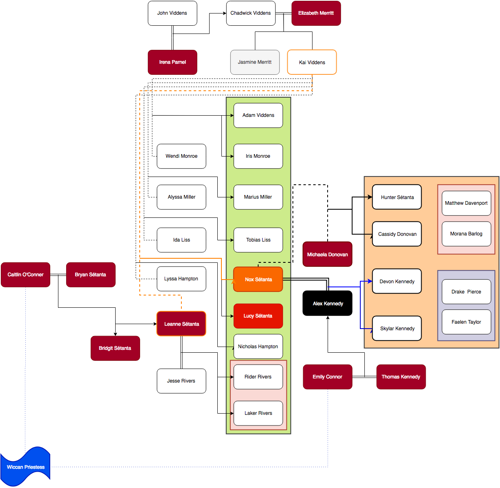

# Nox Sétanta

aka The Third Ascendant, The Bringer of Darkness, The King of New York, Mors Praetor

**Born:** June 21, 1992 @ 12:03am in Boulder, CO  
**Race:** Minorem (half human/half venatori) _[Ascendant]_  

## Family

**Mother:** Leanne Sétanta  
**Father:** Kai Viddens  
**Step-father:** Jesse Rivers  
**Guardian:** Dorian Vega  
**Mentor:**  Dae'lin Rivera formerly Garrett Spencer  
**Siblings:**  

- Iris Monroe (half sister, father's side)
- Adam Viddens (half brother, father's side)
- Marius Viddens (half brother, father's side)  
- Tobias Viddens (half brother, father's side)
- Lucy Sétanta (twin sister) _[still alive]_
- Nicholas Hampton (half brother, father's side)
- Laker Rivers (half brother, mother's side)
- Rider Rivers (half brother, mother's side)

**Children:**  

- _[Cassidy Dononvan]_
- _[Hunter Sétanta]_
- Drake Pierce (adopted)
- Laker Rivers (guardian)
- Rider Rivers (guardian)
- Faelen Taylor (adopted)
- Matthew Davenport (guardian)
- Morana Balrog (guardian)
- _[Devon Kennedy]_
- _[Skylar Kennedy]_

## Description

### Supernatural Abilities

- Magnus (Cesari) - NMC5
- sees patterns/solves puzzles
- intrepid healing but prone to sickness
- superhuman senses but no superhuman reflexes/strength
- _[strongest living Venatori Magnus in generations - eclipses highest rated in any element]_
- _[stronger than Venatori sense of smell due to being a theriantrophy carrier (wolf strain)]_
- _[at birth infused with umbra(order) to become the third ascendant]_
- _[read the language of the umbra]_
- _[use and create rune stones]_
- _[strong connection with the umbra resulting in strange magic around him]_

### Physical

Nox is 6’0″ weighing approximately 145 lbs with a hard to maintain thin athletic build. He has chestnut brown hair with chocolate brown eyes framed with a thick set of eye lashes any woman would die for. He tends to have a few days growth beard mustache carefully managed. Nox almost always has a playful grin plastered on his lips, like everything’s a joke to him.

Nox tends to wear eye liner and dyes the tips of his hair in bright colors with matching finger-nail polish. His favorite colors being sapphire blue, crimson red and orange. He has been known to wear flavored lip gloss.

He likes to wear t-shirts with obnoxious sayings, he thinks they are funny and doesn’t care if you are offended by them. He always wears a hoodie (pull over or zip up). Nox’s hands with his long slender fingers are the most defined feature he possess other than his eyes and smile.

Nox’s body is host to a few scars he’s more than willing to tell you a false tale about how he got them. (A vampire bite on his right forearm. Claw marks on his left rib cage from a were-bear, a slash across his left cheek from the dagger of a ghost possessed human, burn on his right leg from knee to ankle from a dragon’s flame) And one set he doesn’t want to talk about and usually covers up at all times: a series of slash marks across his back from early childhood abuse. He tends to hide these scares underneath clothing or a personal veil he learned from his abuser.

Nox has a delicate black ink dragon he calls 'Mushu' at the back of his neck just below the base of his skull. During his Ad Aetatem Nox received his tribal tattoo – a pair of crossed swords at his right temple.

### Personality

Nox is loud and it can come off as obnoxious. He is almost always ready with a joke or a one liner. He is self-centered, his charm and his attitude tend to get him noticed and he appears to thrive on being center stage. His attitude is infectious but it is also over-the-top and most people tend to take it the wrong way.  He makes more enemies than friends.

Nox believes he is not heroic, but his actions speak louder than his words.

Nox enjoys the company of either sex, but prefers men for anything more than a one night stand. Despite the numerous conquests he is alone.  In an attempt to keep people at a distance Nox flaunts the "I like men" side of his sexuality.   

His self centered, jovial, obnoxious behavior is a cover for the multitude of issues Nox has going through him at any given time.  Nox has been diagnosed with PTSD from a childhood event that even with help continually threatens his nightmares.  He has also been been diagnoses with [OCPD](https://www.healthline.com/health/obsessive-compulsive-personality-disorder).  Nox strives to be the best he can in everything, everything has to be orderly and structured - which includes his meals, and his daily life.  Any sort of change can set Nox off, though he is capable of adapting given enough time to the change.  Nox also has a fear of flying, heights/falling and needles and sometimes clowns.

Nox loves to cook, draw and dance.  He doesn't know how to sit still for long periods of time so he's never been a big movie/tv fan, he prefers to read if he has to sit still for long periods of time.

**Sexuality**
Nox prefers men over women but has no problem having a one night stand with a woman.  Nox enjoys being submissive but has no problem taking control over what he wants.  His only hard limit is abuse - no hitting, even a playful slap on the ass can send him into a bad place.  At 16 Nox was taken in by a sex therapist who helped him learn who he was through BDSM, but by 18 his 'dom' let him go as Nox was too 'alpha' and could cause other problems just being around. A knowing partner can start a scene with _Xiàjiàng_ and end a scene abruptly with _Shàngshēng_ (rise and drop in Chinese respectively).  Nox uses a two tiered safe word, yellow for moments he's had enough of and is nearing an issue, and red to stop completely.  

**Quirks, Habits, & Oddities**  

- Calls women Duckling - soft, cute and cuddly and usually in need of protection
- Nox talks fast (NYC Manhattan accent)
- exaggeration / tell stories that aren't true
- smelling things
- always has a hoodie/long sleeves with him no matter the weather
- doesn't like to drive
- afraid of heights/falling, flying and clowns(minor) amd needles
- must have coffee first thing in the morning
- bites his bottom lip
- has a clearly defined schedule he must stick to
- works out everyday almost to the point of excess
- good at puzzles/patterns
- flirts with everyone
- has depression due to his insecurities
- has anxiety issues when things change
- compensates his issues with a rigid schedule of things (OCD in nature) including (but not limited to) his daily life, what he eats, when he works out, etc
- insomnia due to excessive nightmares from childhood trauma

TRAITS                     |   | SCALE      |    | TRAITS
---------------------------|---|------------|----|---------------------------
Warm                       | 0 | --+------- | 10 | Cold
Outgoing                   | 0 | -+-------- | 10 | Shy
Spender                    | 0 | --------+- | 10 | Saver
Optimist                   | 0 | -------+-- | 10 | Pessimist
Easily Provoked            | 0 | -----+---- | 10 | Easy-Going
Tough-minded               | 0 | ------+--- | 10 | Tender-hearted
Leader                     | 0 | --+------- | 10 | Follower
Arrogant                   | 0 | -+-------- | 10 | Humble
Happy                      | 0 | -------+-- | 10 | Discontent
Impulsive                  | 0 | -+-------- | 10 | Thoughtful
Conventional               | 0 | ------+--- | 10 | Radical Thinker
Emotional                  | 0 | ---+------ | 10 | Rarely shows emotion
Perfectionist              | 0 | +--------- | 10 | Sloppy
Risk-taker                 | 0 | -+-------- | 10 | Cautious
Charismatic                | 0 | --+------- | 10 | Aggravates People
Late                       | 0 | --------+- | 10 | Early for Appointments
Efficient                  | 0 | ---+------ | 10 | Inefficient
Team-oriented              | 0 | -------+-- | 10 | Prefers to work alone
Quiet                      | 0 | ------+--- | 10 | Loud
Subtle                     | 0 | --------+- | 10 | Direct
Selfish                    | 0 | -+-------- | 10 | Selfless
Go-getter                  | 0 | -----+---- | 10 | Lazy
Heroic                     | 0 | -+-------- | 10 | Cowardly
Takes things at face-value | 0 | -------+-- | 10 | Reads between the lines
Tries to Please People     | 0 | ---------+ | 10 | Doesn’t Care What Others Think
Responsible                | 0 | ---+------ | 10 | Irresponsible
Enthusiastic               | 0 | ---+------ | 10 | Unexcitable
Systematic                 | 0 | --+------- | 10 | Scatter-brained
Happy-Go-Lucky             | 0 | --+------- | 10 | Serious

**Possessions:**  
See [Pintrest Board](https://www.pinterest.com/ajsvoices/all-things-nox/)  

**Typical Schedule**  

**Everyday:**
4am wake up  
4:30 yoga/workout/morning run
5:45 shower  
6am breakfast  
_[11 - 2 lunch with Alex]_
11:30 - 12:30 lunch  
6pm evening run  
7:30pm dinner  
11pm bedtime  

**Monday:** 9:30am Therapy, dinner with Ant and crew (breakfast)  
**Tuesday:** afternoon coffee with one of dom's lackies  
**Wednesday:** V&M in the morning  
**Thursday:** drinks at night with Adrian  
**Friday:** late night feeding for Armande  
**Saturday:** dance night, brunch with Kai, afternoon spar with Kai  
**Sunday:** grocery shopping, lunch out, poker night with Ant and crew  

Monthly meetup with Max and Drew (and others) at a boxing gym  
Every July his brothers come out to visit  

**Meal Plan**

Sunday
* [Tomato Basil Fritatta](http://paleoleap.com/tomato-basil-frittata/)
* Eat out for lunch
* Steak and roasted seasonal vegetables

Monday
* Bacon and Eggs
* Leftovers from night before (Steak and vegetables)
* Breakfast for dinner (no shopping required - at Ant's place)

Tuesday
* Tomato Basil Fritatta
* Grilled Chicken salad on rye
* Pot Roast and root vegetables slow cooked with wild rice

Wednesday
* Bacon and Eggs
* Left overs from night before (pot roast)
* Left overs from night before (pot roast)

Thursday
* Tomato Basil Fritatta
* Leftovers from night before
* Baked seasonal fish with seasonal vegetables over white rice

Friday
* Bacon and Eggs
* Leftovers from night before
* Go out to eat night

Saturday
* Tomato Basil Fritatta
* Grilled Chicken salad on rye
* Chicken Stir Fry

Always on hand for quick lunch
* Grilled Chicken salad on rye
* Extra eggs and bacon
* lots of coffee

## History

### The Beginning

Nox’s mother, Leanne Sétanta, was a human Venatori hunter, her parents and twin sister were killed by a rogue werewolf when she was a baby. The Venatori who found her crying and starving in their cabin in the Colorado woods took her in and the community raiser her as one of their own and taught her the way of the Venatori.

Kai Viddens is a Venatori hunter. He has had no wives but many female companions. He has 6 children, 5 of which he raised. Kai found out about Nox when Nox was 18 at his Ad Aetatem. He met Leanne when he was passing through Colorado in 1991 chasing a rogue vampire. Kai was unaware she was human and later became with child. Leanne was one of the rare women to survive the birth of Minorem.

_[Nox was born one of two twins.  His sister Lucy was 'removed' from the pattern in her hospital crib.  A dragon was sent to kill the netherborn, but instead a deal was struck with an agent of chaos (Brandon Holt), and Lucy was taken, and Nox left alive.  But Leanne's memory of her daughter was removed as well as her love of her son.]_

At the age of 5 Nox started showing signs of being a Magnus like his father by starting a fire after his mother shook him for making a mess.  She spit on him and called him a monster before throwing a fire extinguisher at his head and sending Nox to bed. His mother hurriedly dumped Nox on the Venatori for training. He was picked up at the airport by Dorian Vega. At the time of his admittance Nox was designated NNI5 and started his official training early. Garrett Spencer was assigned to be his fire-starter instructor.  Nox didn't hear from his mother again until he was 18.

_[When Nox comes into power he also begins drawing his twin flame into his dreams where they build towers, and destroy them together.  Nox always dreams the same thing every night - he's a small boy, dressed in a green flannel monster suit with red feet.  The room is stark white, the colored blocks are the only color other than Nox himself, and a painting on the wall (a window into his true dreamscape) and it whispers MONSTER at every corner, even the blocks spell monster.  Nox builds towers and stomps them becoming the monster they whisper. He and the boy make a connection.]_

Upon arrival at the Apex Unlimited Building in New York City, Nox was tested in all elements. He was found to be capable of bending all 4 elements – he was designated NNIAeTA5.  His first roommate Aaron Woolbright another firestarter steals Nox's favorite toy Mushu, and in an emotional attempt to get him back Nox accidentally starts a fire.  In Aaron's fear and haste Mushu is tossed aside and captured by the flames.  Only Dorian was able to console Nox.

_[Garrett Spencer mentally abused Nox on the dream plane in order to teach him to control the fire within. In one instance Nox's twin flame joins him and Garrett turns his ire on the boy, Nox grasps fire willingly to defend the boy.  Nox and his twin flame vow to protect one another's dreams from the bad man.  The twin flames power so strong it eradicates all memories of him, past, present and future dreams are boxed away hidden where no one will ever look.  Meanwhile the twin flame only forgot the bad man and Nox's nightmare.]_

At the age of 6 upon final assessment as a fire-starter Nox created a fire that caught on Garrett’s pants and worsened before Nox put it out. This incident was deemed an accident and Nox was held in observation with Dr. Margo Silverman for 3 months and assigned a new mentor, Dae’lin Rivera. _[This was not an accident, both Nox and Garrett knew this.  Nox purposefully lit Garrett on fire because the man was going to hurt him one last time and Nox had enough.]_

Nox begins having nightmares every night sometimes waking with his back bloody and broken.  Every morning Nox sketches his nightmare as part of his therapy. Sometimes other things make those same pages from his dreams, but not often. _[After Garrett can no longer teach Nox, he assigns a 'nightmare' to him from the demon Morpheus who then feeds the boys fear to its master.  The night mares happen regardless of time, (as long as it's still dark out) and always wakes Nox up at 4am regardless of when the demon takes him into it.  Sleeping during the day only results in worse nightmares the next time Nox is caught.  The dreams flay Nox in the real world leaving torturous scars across his back.]_

Nox spent another year in fire-starter training.

The next 4 years Nox spent his time learning each element bending them individually – fire, air, earth and then water. Dae’lin was routinely frustrated with him even as she demanded perfect As in order to maintain his training schedule.

Despite therapy not being required Nox continues to go religiously every Monday at 9:30am.  At the age of 6 Nox meets another boy in the waiting room, he doesn't like to be touched, but he and Sage hit it off becoming best of friends.

Nox quickly becoming an outsider in The Academy. Nox is continually picked on by Aaron Woolbright (and his friends) another fire-starter like himself. Nox is placed in a room with Aaron and Ross Cortes. The room hold four individuals, but their fourth always seemed to be placed in another room for varying reasons leaving Nox a bunk to himself, though he always slept on the bottom on.  Aaron and Nox continued to have problems even into adulthood.

(8 years old) Nox at the suggestion of Margo starts trying to conquer his fear of heights/falling. Nox starts testing various heights and jumping. Nox is soon vaulting from the top of the AU building.

Every year in October Nox has a bad time.  It's the anniversary of his arrival at the AU building, the loss of Mushu in a fire.  The days leading up to the 23rd of October are nothing compared to the torment Nox goes through on that special day.  At the age of 9, Aaron and Ross push Nox too far and Nox bottoms out and slits his wrists with a fine razor of air, but his super healing prevents him from dying, but the boys tell on him and Nox is remanded to mandatory therapy again.  During this time, Nox meets his first human girl, and she becomes friends with him, and Sage, and Mia becomes the ring leader to their followers.

Mia talks Nox into sneaking out of the AU building to do normal human things.  When Dorian finds out he starts finding Nox human tutors for cooking and dancing since Dorian had willing friends to teach him those skills.

(10 years old) During his 5th year at The Academy Nox created a sculpture utilizing all four elements at the same time as an art project for his creativity lessons. This feat named him Cesari. The statue sits in the lobby of the Apex Unlimited Building. He was designated NNC5.

Later that year, per the usual testing requirements, Skill mastery is tested. Nox passed into Adept surpassing most his age. He was designated ANC5. (Dorian preforms the test)

Nox becomes an excellent cook by age 12, and was well versed in dances by the same age.

The October after his twelvth birthday Nox was jumping off the AU building trying to releive his stresses, and control something in his life when he decided to just jump and let it end there, but half way through the fall Nox changed his mind a pair of blue eyes flashing in front of his eyes and he saved himself most of the damage only resulting in a broken arm from the fall.  Margo did not tell anyone what had happened, Nox was seeing a therapist, no need for the attempt to go on his school record.

_[Nox and his twin flame's relationship in the dream dramatically changes as both boys are attracted to one another.  They share their first kiss.]_

At the age of 13 Nox had his first crush – on another boy. After one particular swim meet win Nox kissed Dylan, only to receive a beat down in return.

_[Nox and his twin flame quickly move from kissing to making out, to full on penetrative sex in the dream.  Nox is falling hard and fast for this boy but can never remember.]_

Shortly there after, while Nox was watching his crush he was discovered by a girl a few years older, Madison Pratt. She was Nox’s first. Nox explores his sexuality almost entirely out of the compound with the occasional dalliance with fellow members of The Academy.  Once getting caught just before the act with Nicholas Hampton, who later turns out to be his half brother.

Nox's reputation with the girls at the Academy was one that spoke to how easy he was to sleep with them, and then they could forget it even happened, he wouldn't care.  Though they snickered behind his back but when they were alone it was a different story wanting to see/touch and do more.  Dorian had a sit down with Nox about protection and him.  It wasn't a birds and bee talk - but a facts about having sex talk down to the nitty gritty of protection.  

Six months after Madison, Nox snuck out without his human friends and found himself in a gay bar where he let a brusk man take him in the back store room and 'fuck' him even though the man claimed to be straight.  This was set the standard for Nox's typical male hookup, while his females continued to be one night stands.

The October following his 14th birthday Nox found a way to get Nepenthe - a drug that works on Venatori metabolism quickly without dying out quickly.  He only did it once. _[Nox's Twin flame found him higher than a kite and they worked through the issue of Nox's desire and making a promise he'd later not remember, but Nox never touched it again.]_

Mia, Sage and Nox continued to sneak out at night doing things their parents wouldn't like.  They found themselves with Jason Hill who was several years older than they were.  He took them places they couldn't normally go, most notably parties where there was drinking, sex and drugs.  Sage found his kink in watching.  Mia and Jace enjoyed group sex, and Nox found himself a submissive to agressive men or sleeping with whatever girl would have him.  Nox was using sex as a drug to dull his lonliness.

At one party Nox was found by Adrian Sheridan, a werewolf who was also a dom and a sex therapist.  He had been watching Nox the whole night and wanted to help him.  He taught Nox over the next few years how to be submissive, how to take initiative, and how to not be a doormat while losing the power struggle.  

_[During one dream with his twin flame Nox promises to get a tattoo of his lover/friend though he doesn't know his name, or what he looks like he promises - though Nox never remembers.  Nox sometimes calls his friend his Mushu.]_

At sixteen while trying to fit in Nox found himself with a bunch of guys (his roommates included) getting drunk, daring one another to do stupid things. They dared Nox to get a tattoo. Being drunk was the only thing that allowed him to surpass his fear of needles.  Nox gets the tattoo of Mushu at the back of his neck.

Just before his seventeenth birthday Adrian told Nox that he couldn't help him anymore.  And while they remained friends, the therapy and sexual training was at its end.

::: spoiler the-first-hunt
### The First Hunt
:::

### The Third Ascendant Arc

### The Bringer of Darkness

### After

## Group Affiliations _work out his relationships_

**The Venatori**

**Human**  

**Manhattan Werewolf Pack**  

**Lone Wolf Pack**  

**Il Cane**  

**V&M/CCB**  

## Character Sheet

**Zodiac:** Cancer [Birth Chart](https://horoscopes.astro-seek.com/calculate-birth-chart-horoscope-online/?send_calculation=1&narozeni_den=21&narozeni_mesic=6&narozeni_rok=1992&narozeni_hodina=00&narozeni_minuta=03&narozeni_city=Boulder%2C+USA%2C+Colorado&narozeni_mesto_hidden=Boulder&narozeni_stat_hidden=US&narozeni_podstat_kratky_hidden=CO&narozeni_podstat_hidden=Colorado&narozeni_input_hidden=&narozeni_podstat2_kratky_hidden=&narozeni_podstat3_kratky_hidden=&narozeni_sirka_stupne=40&narozeni_sirka_minuty=1&narozeni_sirka_smer=0&narozeni_delka_stupne=105&narozeni_delka_minuty=16&narozeni_delka_smer=1&narozeni_timezone_form=auto&narozeni_timezone_dst_form=auto&house_system=placidus&hid_chiron=1&hid_chiron_check=on&hid_lilith=1&hid_lilith_check=on&hid_uzel=1&hid_uzel_check=on&tolerance=1&tolerance_paral=1.2#tabs_redraw)  

[Personality Type](https://memorado.com/pti_test): INTP - THE THINKER

**Problem:**  
Nox's problem is that he has felt like an outcast and unwanted his whole life.

**Solution:**
Nox's solution is two tiered - the first to push most people way by being fake/always joking etc., the second is when he does let you in he becomes overly attached.

### Enneagram Personality
[Personality](http://characterchange.com/9-character-types-that-will-improve-your-story/): The Artists (#4)  
[Fundamental Fear](http://characterchange.com/9-fundamental-fears-that-motivate-your-characters/): Fear of being insignificant

### [The Four Cornerstores](http://www.writingeekery.com/four-cornerstones-of-strong-characters/)
**The Fear:** Nox is afraid of being the same monster that his mother called him.    
**The Secret:** Nox knows a lot more than he really lets on although a great deal of it has been blocked by an important event in his past.    
**The Flaw:** Nox wants to save/help/protect everyone above himself.    
**The Quirk:** Nox hates riding in elevators. (??)  

### [The Four Pillars](http://www.writingeekery.com/strong-character-pillars/)
**The Desire:** Nox desires to part of something - anything - unconditionally.    
**The Strength:** Nox has the courage to keep on going even though he knows he's all alone.    
**The Inner Conflict:** Nox desires to be a part of something, but he beleives he's not worthy.
**The Character Theme:** Despite himself Nox is much more than he thought he could ever be, he only needed to believe in himself.    
